<h1 align="center">
   📊 CandleView
</h1>
<h4 align="center">
Chart engine in the financial field.
</h4>
<p align="center">
  <a href="https://https://github.com/0xhappyboy/candleview/LICENSE"></a>
</p>
<p align="center">
<a href="./README_zh-CN.md">简体中文</a> | <a href="./README.md">English</a>
</p>

# 🚀 Quick Start

```typescript
import { CandleView } from "./CandleView";

const App = () => {
  return (
    <CandleView
      title="BTC/USDT"
      height={600}
      theme="dark"
      i18n="en"
      showToolbar={true}
      showLeftPanel={true}
      showTopPanel={true}
      timeframe="1d"
      timezone="America/New_York"
      data={klineData}
    />
  );
};
```

# Preview

## Draw Graphics

### Fibonacci

<table>
  <tr>
    <td align="left">
    <h4>Arc</h4>
    </td>
    <td align="left">
    <h4>Channel</h4>
    </td>
     <td align="left">
    <h4>Circle</h4>
    </td>
  </tr>
  <tr>
    <td align="center">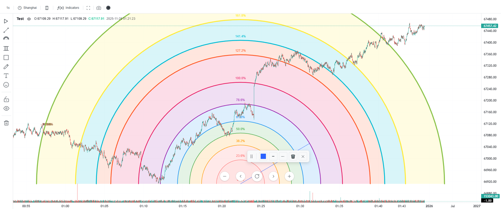</td>
    <td align="center">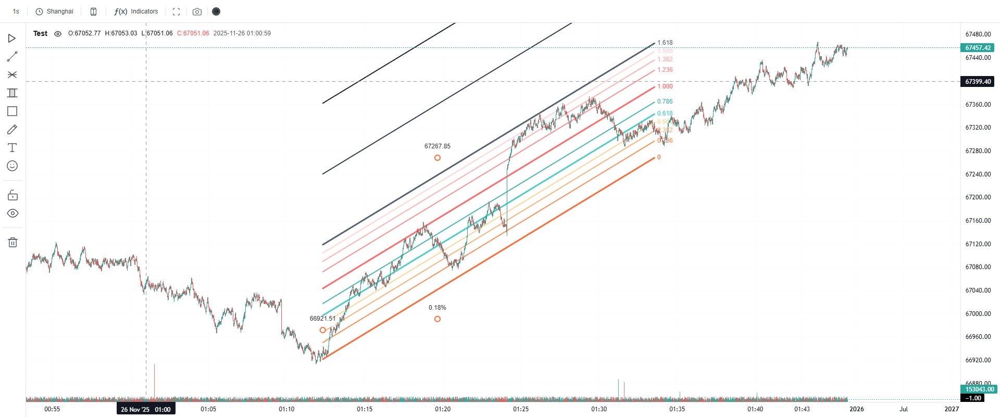</td>
    <td align="center">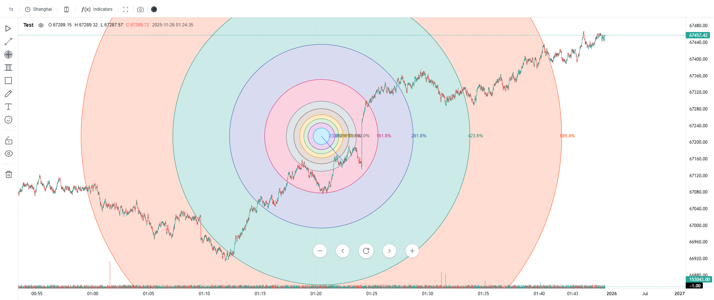</td>
  </tr>
   <tr>
    <td align="left">
    <h4>Fan</h4>
    </td>
    <td align="left">
    <h4>Price Extension</h4>
    </td>
     <td align="left">
    <h4>Retracement</h4>
    </td>
  </tr>
  <tr>
    <td align="center">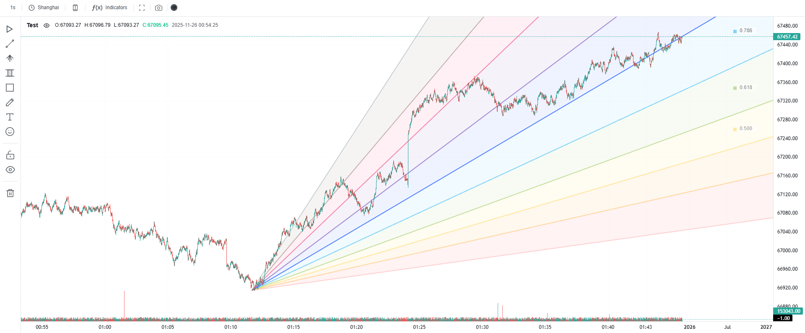</td>
    <td align="center">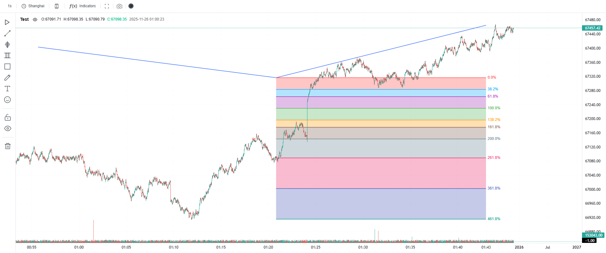</td>
    <td align="center">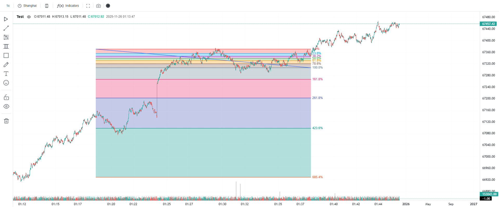</td>
  </tr>
   <tr>
    <td align="left">
    <h4>Spiral</h4>
    </td>
    <td align="left">
    <h4>Time Expansion</h4>
    </td>
     <td align="left">
    <h4>Time Zoon</h4>
    </td>
  </tr>
  <tr>
    <td align="center">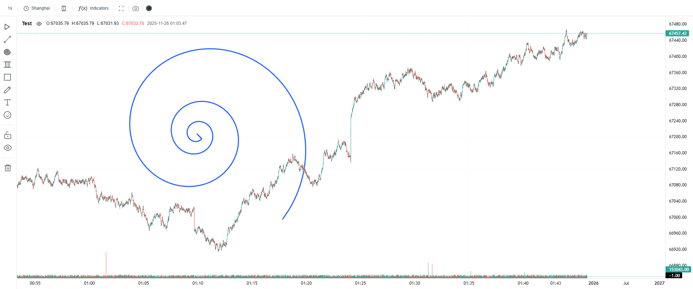</td>
    <td align="center">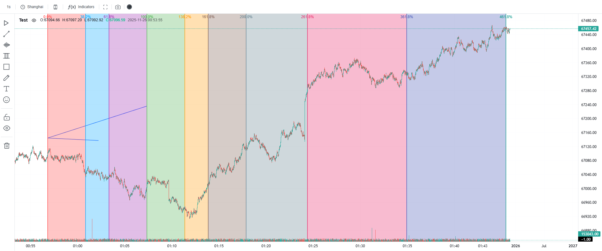</td>
    <td align="center">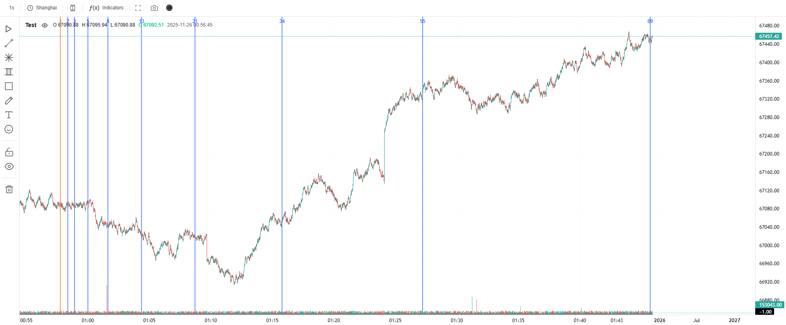</td>
  </tr>
   <tr>
    <td align="left">
    <h4>Wedge</h4>
    </td>
    <td align="left">
    </td>
     <td align="left">
    </td>
  </tr>
  <tr>
    <td align="center">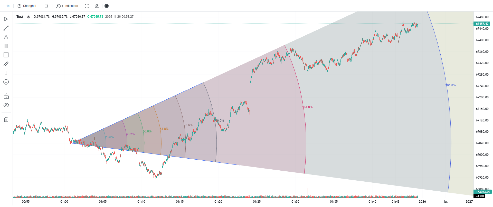</td>
  </tr>
</table>

### Gann

<table>
  <tr>
    <td align="left">
    <h4>Box</h4>
    </td>
    <td align="left">
    <h4>Fan</h4>
    </td>
     <td align="left">
    <h4>Rectangle</h4>
    </td>
  </tr>
  <tr>
    <td align="center">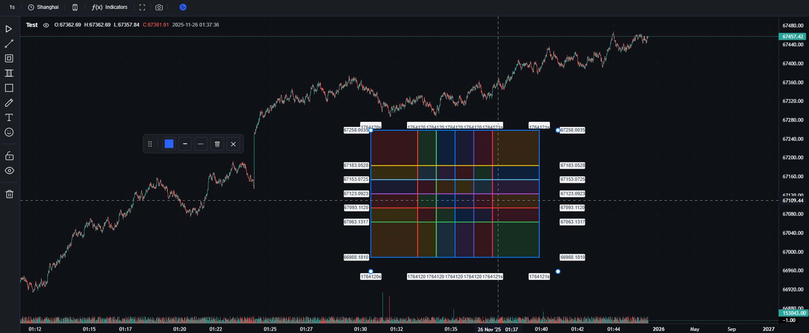</td>
    <td align="center">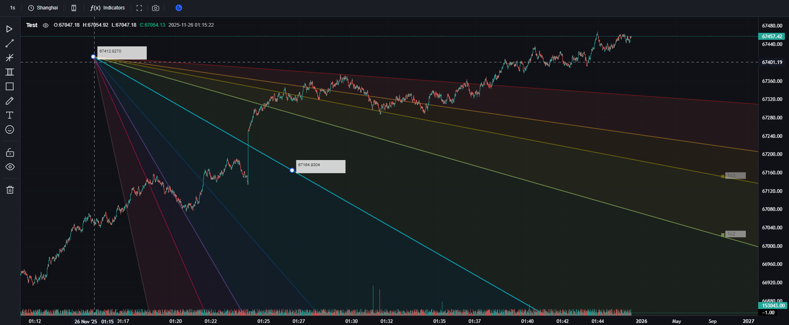</td>
    <td align="center">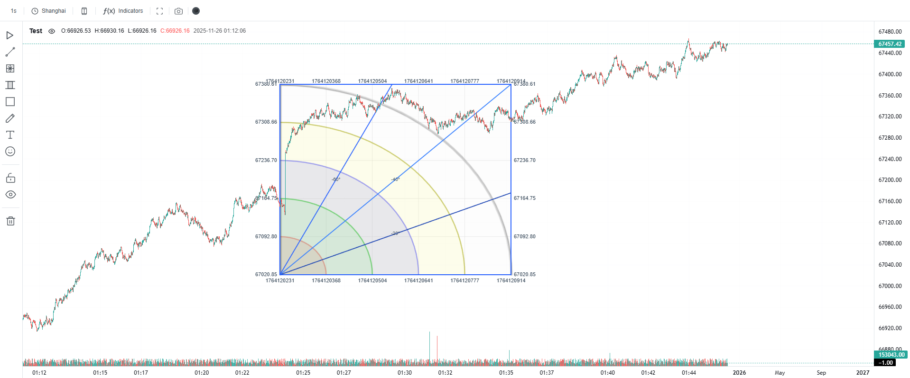</td>
  </tr>
</table>

### Mark

<table>
  <tr>
    <td align="left">
    <h4>Mark</h4>
    </td>
  </tr>
  <tr>
    <td align="center">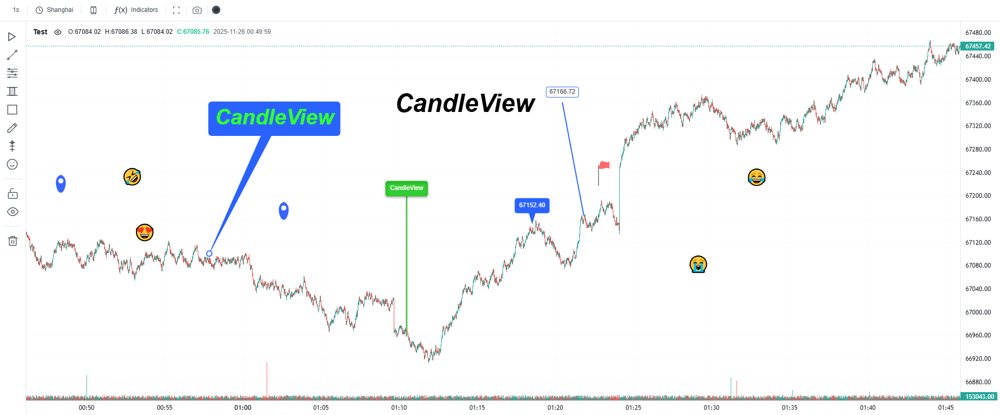</td>
  </tr>
</table>

## Theme

<table>
  <tr>
    <td align="left">
    <h4>Dark</h4>
    </td>
    <td align="left">
    <h4>Light</h4>
    </td>
  </tr>
  <tr>
    <td align="center">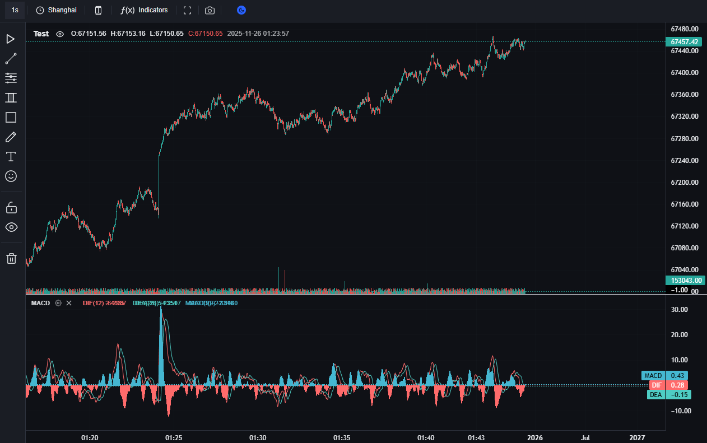</td>
    <td align="center">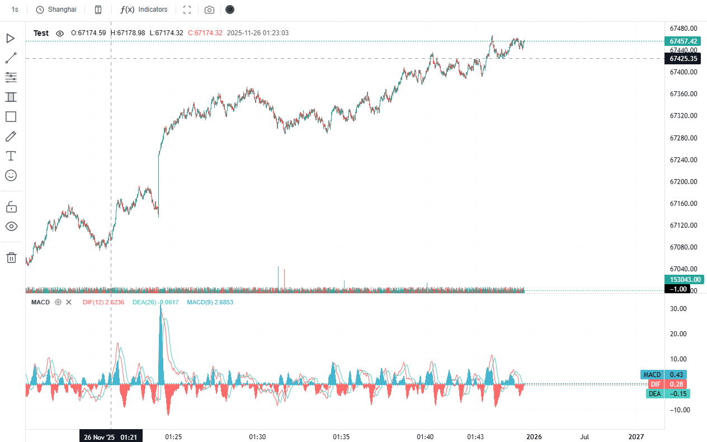</td>
  </tr>
</table>

## I18n

<table>
  <tr>
    <td align="left">
    <h4>En</h4>
    </td>
    <td align="left">
    <h4>zh-CN</h4>
    </td>
  </tr>
  <tr>
    <td align="center">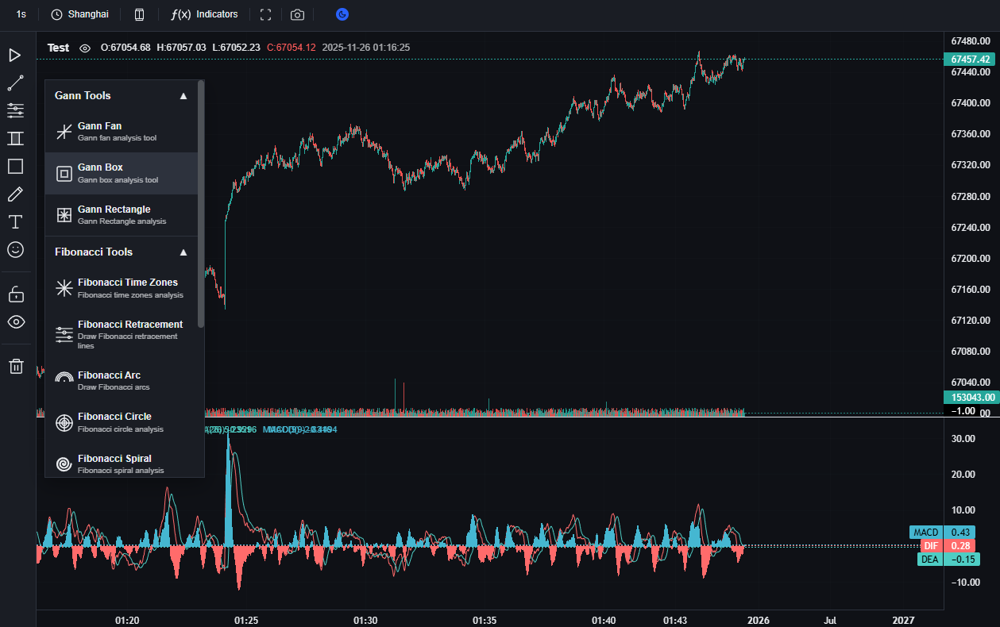</td>
    <td align="center">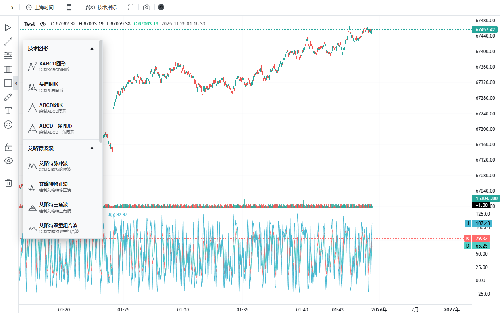</td>
  </tr>
</table>

# 🔧 Configuration Options

## Props

| Parameter                 | Type                                                                                                     | Default           | Description                              | Required |
| ------------------------- | -------------------------------------------------------------------------------------------------------- | ----------------- | ---------------------------------------- | -------- |
| `theme`                   | `'dark' \| 'light'`                                                                                      | `'dark'`          | Theme mode                               | No       |
| `i18n`                    | `'en' \| 'zh-cn'`                                                                                        | `'zh-cn'`         | Language setting                         | No       |
| `height`                  | `number \| string`                                                                                       | `500`             | Chart height (px or percentage)          | No       |
| `title`                   | `string`                                                                                                 | `''`              | Chart title displayed on the chart       | Yes      |
| `showToolbar`             | `boolean`                                                                                                | `true`            | Show top toolbar                         | No       |
| `showLeftPanel`           | `boolean`                                                                                                | `true`            | Show left drawing tools panel            | No       |
| `showTopPanel`            | `boolean`                                                                                                | `true`            | Show top settings panel                  | No       |
| `showIndicators`          | `boolean`                                                                                                | `true`            | Show indicators panel                    | No       |
| `timeframe`               | `string`                                                                                                 | `'1d'`            | Chart timeframe (e.g., '1m', '1h', '1d') | No       |
| `timezone`                | `string`                                                                                                 | `'Asia/Shanghai'` | Timezone for data display                | No       |
| `data`                    | `ICandleViewDataPoint[]`                                                                                 | `[]`              | K-line data array                        | No       |
| `jsonFilePath`            | `string`                                                                                                 | `''`              | Path to JSON data file                   | No       |
| `url`                     | `string`                                                                                                 | `''`              | URL to fetch data from                   | No       |
| `markData`                | `IStaticMarkData[]`                                                                                      | `[]`              | Pre-drawn marks data                     | No       |
| `handleScreenshotCapture` | `(imageData: { dataUrl: string; blob: Blob; width: number; height: number; timestamp: number }) => void` | `undefined`       | Callback for screenshot capture          | No       |

## ⏰ Supported Timeframes

### Second-based Timeframes

| Value   | Display Name       | Description |
| ------- | ------------------ | ----------- |
| `'1S'`  | 1 秒 / 1 Second    | 1 second    |
| `'5S'`  | 5 秒 / 5 Seconds   | 5 seconds   |
| `'15S'` | 15 秒 / 15 Seconds | 15 seconds  |
| `'30S'` | 30 秒 / 30 Seconds | 30 seconds  |

### Minute-based Timeframes

| Value   | Display Name       | Description |
| ------- | ------------------ | ----------- |
| `'1M'`  | 1 分 / 1 Minute    | 1 minute    |
| `'3M'`  | 3 分 / 3 Minutes   | 3 minutes   |
| `'5M'`  | 5 分 / 5 Minutes   | 5 minutes   |
| `'15M'` | 15 分 / 15 Minutes | 15 minutes  |
| `'30M'` | 30 分 / 30 Minutes | 30 minutes  |
| `'45M'` | 45 分 / 45 Minutes | 45 minutes  |

### Hour-based Timeframes

| Value   | Display Name       | Description |
| ------- | ------------------ | ----------- |
| `'1H'`  | 1 小时 / 1 Hour    | 1 hour      |
| `'2H'`  | 2 小时 / 2 Hours   | 2 hours     |
| `'3H'`  | 3 小时 / 3 Hours   | 3 hours     |
| `'4H'`  | 4 小时 / 4 Hours   | 4 hours     |
| `'6H'`  | 6 小时 / 6 Hours   | 6 hours     |
| `'8H'`  | 8 小时 / 8 Hours   | 8 hours     |
| `'12H'` | 12 小时 / 12 Hours | 12 hours    |

### Day-based Timeframes

| Value  | Display Name  | Description |
| ------ | ------------- | ----------- |
| `'1D'` | 1 日 / 1 Day  | 1 day       |
| `'3D'` | 3 日 / 3 Days | 3 days      |

### Week-based Timeframes

| Value  | Display Name   | Description |
| ------ | -------------- | ----------- |
| `'1W'` | 1 周 / 1 Week  | 1 week      |
| `'2W'` | 2 周 / 2 Weeks | 2 weeks     |

### Month-based Timeframes

| Value    | Display Name    | Description |
| -------- | --------------- | ----------- |
| `'1MON'` | 1 月 / 1 Month  | 1 month     |
| `'3MON'` | 3 月 / 3 Months | 3 months    |
| `'6MON'` | 6 月 / 6 Months | 6 months    |

## 🌍 Supported Timezones

### Americas

| Timezone ID             | Display Name         | UTC Offset  | Major Cities               |
| ----------------------- | -------------------- | ----------- | -------------------------- |
| `'America/New_York'`    | 纽约 / New York      | UTC-5/UTC-4 | New York, Washington DC    |
| `'America/Chicago'`     | 芝加哥 / Chicago     | UTC-6/UTC-5 | Chicago, Dallas            |
| `'America/Denver'`      | 丹佛 / Denver        | UTC-7/UTC-6 | Denver, Phoenix            |
| `'America/Los_Angeles'` | 洛杉矶 / Los Angeles | UTC-8/UTC-7 | Los Angeles, San Francisco |
| `'America/Toronto'`     | 多伦多 / Toronto     | UTC-5/UTC-4 | Toronto, Montreal          |

### Europe

| Timezone ID       | Display Name         | UTC Offset  | Major Cities         |
| ----------------- | -------------------- | ----------- | -------------------- |
| `'Europe/London'` | 伦敦 / London        | UTC+0/UTC+1 | London, Dublin       |
| `'Europe/Paris'`  | 巴黎 / Paris         | UTC+1/UTC+2 | Paris, Berlin        |
| `'Europe/Berlin'` | 法兰克福 / Frankfurt | UTC+1/UTC+2 | Frankfurt, Amsterdam |
| `'Europe/Zurich'` | 苏黎世 / Zurich      | UTC+1/UTC+2 | Zurich, Vienna       |
| `'Europe/Moscow'` | 莫斯科 / Moscow      | UTC+3       | Moscow, Istanbul     |

### Asia

| Timezone ID        | Display Name       | UTC Offset | Major Cities            |
| ------------------ | ------------------ | ---------- | ----------------------- |
| `'Asia/Dubai'`     | 迪拜 / Dubai       | UTC+4      | Dubai, Abu Dhabi        |
| `'Asia/Karachi'`   | 卡拉奇 / Karachi   | UTC+5      | Karachi, Lahore         |
| `'Asia/Kolkata'`   | 加尔各答 / Kolkata | UTC+5:30   | Kolkata, Mumbai         |
| `'Asia/Shanghai'`  | 上海 / Shanghai    | UTC+8      | Shanghai, Beijing       |
| `'Asia/Hong_Kong'` | 香港 / Hong Kong   | UTC+8      | Hong Kong, Macau        |
| `'Asia/Singapore'` | 新加坡 / Singapore | UTC+8      | Singapore, Kuala Lumpur |
| `'Asia/Tokyo'`     | 东京 / Tokyo       | UTC+9      | Tokyo, Seoul            |
| `'Asia/Seoul'`     | 首尔 / Seoul       | UTC+9      | Seoul, Pyongyang        |

### Pacific

| Timezone ID          | Display Name      | UTC Offset    | Major Cities         |
| -------------------- | ----------------- | ------------- | -------------------- |
| `'Australia/Sydney'` | 悉尼 / Sydney     | UTC+10/UTC+11 | Sydney, Melbourne    |
| `'Pacific/Auckland'` | 奥克兰 / Auckland | UTC+12/UTC+13 | Auckland, Wellington |

### Global

| Timezone ID | Display Name | UTC Offset | Description                |
| ----------- | ------------ | ---------- | -------------------------- |
| `'UTC'`     | UTC / UTC    | UTC+0      | Coordinated Universal Time |

## 📄 Data structure

```typescript
interface ICandleViewDataPoint {
  time: number; // timestamp in seconds
  open: number;
  high: number;
  low: number;
  close: number;
  volume?: number;
}

export interface IStaticMarkData {
  time: number;
  type: string;
  data: {
    direction: string;
    text: string;
    fontSize?: number;
    textColor?: string;
    backgroundColor?: string;
    isCircular?: boolean;
    padding?: number;
  }[];
}
```

# 🌟 Core Features

## 📈 Supported Technical Indicators

### Main Chart Indicators

- Moving Average (MA)
- Exponential Moving Average (EMA)
- Bollinger Bands
- Ichimoku Cloud
- Donchian Channel
- Envelope
- Volume Weighted Average Price (VWAP)
- Heat Map
- Market Profile

### Sub Chart Indicators

- Relative Strength Index (RSI)
- Moving Average Convergence Divergence (MACD)
- Volume
- Parabolic SAR
- KDJ Indicator
- Average True Range (ATR)
- Stochastic Oscillator
- Commodity Channel Index (CCI)
- Bollinger Bands Width
- Average Directional Index (ADX)
- On Balance Volume (OBV)

## 🎨 Supported Drawing Tools

### Basic Tools

- Pencil, Pen, Brush, Marker Pen, Eraser
- Line Segment, Horizontal Line, Vertical Line
- Arrow Line, Thick Arrow Line

### Channel Tools

- Parallel Channel
- Linear Regression Channel
- Equidistant Channel
- Disjoint Channel

### Fibonacci Tools

- Fibonacci Retracement
- Fibonacci Time Zones
- Fibonacci Arc
- Fibonacci Circle
- Fibonacci Spiral
- Fibonacci Fan
- Fibonacci Channel
- Fibonacci Price Extension
- Fibonacci Time Extension

### Gann Tools

- Gann Fan
- Gann Box
- Gann Rectangle

### Pattern Tools

- Andrew Pitchfork
- Enhanced Andrew Pitchfork
- Schiff Pitchfork
- XABCD Pattern
- Head and Shoulders
- ABCD Pattern
- Triangle ABCD Pattern

### Elliott Wave

- Elliott Impulse Wave
- Elliott Corrective Wave
- Elliott Triangle
- Elliott Double Combination
- Elliott Triple Combination

### Geometric Shapes

- Rectangle, Circle, Ellipse, Triangle
- Sector, Curve, Double Curve

### Annotation Tools

- Text Annotation, Price Note
- Bubble Box, Pin, Signpost
- Price Label, Flag Mark
- Image Insertion

### Range Tools

- Time Range, Price Range
- Time-Price Range
- Heat Map

### Trading Tools

- Long Position, Short Position
- Mock K-line

## ⏰ Supported Timeframes

### Second-based

- 1s, 5s, 15s, 30s

### Minute-based

- 1m, 3m, 5m, 15m
- 30m, 45m

### Hour-based

- 1h, 2h, 3h, 4h
- 6h, 8h, 12h

### Day-based

- 1d, 3d

### Week-based

- 1w, 2w

### Month-based

- 1M, 3M, 6M

## 🌍 Supported Timezones

- New York (America/New_York)
- Chicago (America/Chicago)
- Denver (America/Denver)
- Los Angeles (America/Los_Angeles)
- Toronto (America/Toronto)
- London (Europe/London)
- Paris (Europe/Paris)
- Frankfurt (Europe/Berlin)
- Zurich (Europe/Zurich)
- Moscow (Europe/Moscow)
- Dubai (Asia/Dubai)
- Karachi (Asia/Karachi)
- Kolkata (Asia/Kolkata)
- Shanghai (Asia/Shanghai)
- Hong Kong (Asia/Hong_Kong)
- Singapore (Asia/Singapore)
- Tokyo (Asia/Tokyo)
- Seoul (Asia/Seoul)
- Sydney (Australia/Sydney)
- Auckland (Pacific/Auckland)
- UTC

## 🎯 Supported Chart Types

- Candlestick Chart
- Hollow Candlestick Chart
- Bar Chart (OHLC)
- BaseLine Chart
- Line Chart
- Area Chart
- Step Line Chart
- Heikin Ashi Chart
- Histogram Chart
- Line Break Chart
- Mountain Chart
- Baseline Area Chart
- High Low Chart
- HLCArea Chart
