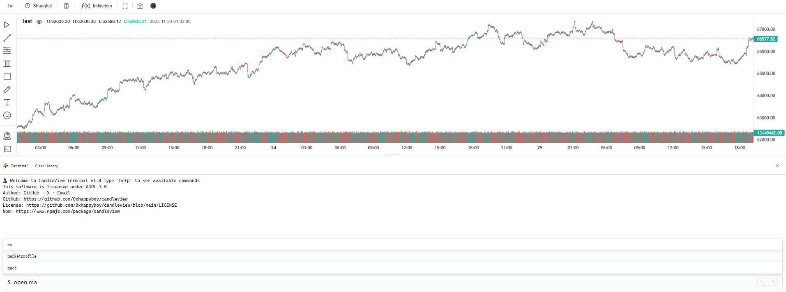

<p align="center">
  <table align="center" border="0" cellpadding="0" cellspacing="0" style="border: none !important; border-collapse: collapse !important;">
    <tr style="border: none !important;">
      <td style="border: none !important; padding: 0;"></td>
      <td style="border: none !important; padding: 0 0 0 10px;"><h1 style="margin: 0;">烛光视图</h1></td>
    </tr>
  </table>
</p>
<h4 align="center">
面向金融行业的数据可视化图表与图形绘制引擎.
</h4>
<p align="center">
  <a href="https://github.com/0xhappyboy/candleview/LICENSE"></a>
</p>
<p align="center">
<a href="./README_zh-CN.md">简体中文</a> | <a href="./README.md">English</a>
</p>

# ⚙️ 安装

```bash
npm i candleview
```

```bash
yarn add candleview
```

# 🚀 快速启动

```typescript
import { CandleView } from "./CandleView";

const App = () => {
  return (
    <CandleView
      data={candleData}
      title="Test"
      theme={theme}
      i18n={i18n}
      markData={markData}
      height={800}
      leftpanel={true}
      toppanel={true}
      terminal={true}
    />
  );
};
```

# 💻 命令系统



## 支持的命令

### 基本命令

| 命令                 | 说明                   | 示例         |
| -------------------- | ---------------------- | ------------ |
| `clear` / `cls`      | 清空终端输出           | `clear`      |
| `help`               | 显示所有可用命令和指标 | `help`       |
| `theme [light dark]` | 切换主题               | `theme dark` |
| `history`            | 显示最近执行的命令历史 | `history`    |

### 指标操作命令

| 命令                | 说明                     | 示例        |
| ------------------- | ------------------------ | ----------- |
| `open [indicator]`  | 开启指定的主图或副图指标 | `open ma`   |
| `close [indicator]` | 关闭指定的主图或副图指标 | `close rsi` |

### 支持的主图指标（Main Chart Indicators）

- **ma** - 移动平均线（Moving Average）
- **ema** - 指数移动平均线（Exponential Moving Average）
- **bollinger** - 布林带（Bollinger Bands）
- **ichimoku** - 一目均衡表（Ichimoku Cloud）
- **donchian** - 唐奇安通道（Donchian Channel）
- **envelope** - 包络线（Envelope）
- **vwap** - 成交量加权平均价（Volume Weighted Average Price）
- **heatmap** - 热力图（Heatmap）
- **marketprofile** - 市场概况（Market Profile）

### 支持的副图指标（Sub Chart Indicators）

- **rsi** - 相对强弱指数（Relative Strength Index）
- **macd** - 指数平滑异同移动平均线（Moving Average Convergence Divergence）
- **volume** - 成交量（Volume）
- **sar** - 抛物线转向指标（Parabolic SAR）
- **kdj** - 随机指标（KDJ）
- **atr** - 平均真实波幅（Average True Range）
- **stochastic** - 随机震荡指标（Stochastic Oscillator）
- **cci** - 商品通道指数（Commodity Channel Index）
- **bbwidth** - 布林带宽度（Bollinger Bands Width）
- **adx** - 平均趋向指数（Average Directional Index）
- **obv** - 能量潮指标（On Balance Volume）

### 快捷键

| 快捷键     | 功能                         |
| ---------- | ---------------------------- |
| `↑` / `↓`  | 在命令历史中导航             |
| `Tab`      | 自动补全当前建议的命令或指标 |
| `Enter`    | 执行当前命令或确认补全       |
| `Ctrl + L` | 清空输入框                   |
| `Ctrl + C` | 取消当前操作                 |
| `Esc`      | 清空输入框并隐藏建议列表     |

### 使用示例

```bash
$ open ma # 开启移动平均线
$ close bollinger # 关闭布林带
$ theme light # 切换到浅色主题
$ history # 查看最近执行的命令
```

# 预览

## 绘制图形

### 斐波那契

<table>
  <tr>
    <td align="left">
    <h4>斐波那契弧形</h4>
    </td>
    <td align="left">
    <h4>斐波那契通道</h4>
    </td>
     <td align="left">
    <h4>斐波那契圆</h4>
    </td>
  </tr>
  <tr>
    <td align="center"></td>
    <td align="center"></td>
    <td align="center"></td>
  </tr>
   <tr>
    <td align="left">
    <h4>斐波那契扇</h4>
    </td>
    <td align="left">
    <h4>斐波那契价格扩展线</h4>
    </td>
     <td align="left">
    <h4>斐波那契回调</h4>
    </td>
  </tr>
  <tr>
    <td align="center"></td>
    <td align="center"></td>
    <td align="center"></td>
  </tr>
   <tr>
    <td align="left">
    <h4>斐波那契螺旋</h4>
    </td>
    <td align="left">
    <h4>斐波那契时间扩展</h4>
    </td>
     <td align="left">
    <h4>斐波那契时间区间</h4>
    </td>
  </tr>
  <tr>
    <td align="center"></td>
    <td align="center"></td>
    <td align="center"></td>
  </tr>
   <tr>
    <td align="left">
    <h4>斐波那契楔形</h4>
    </td>
    <td align="left">
    </td>
     <td align="left">
    </td>
  </tr>
  <tr>
    <td align="center"></td>
  </tr>
</table>

### 江恩系列

<table>
  <tr>
    <td align="left">
    <h4>Box</h4>
    </td>
    <td align="left">
    <h4>Fan</h4>
    </td>
     <td align="left">
    <h4>Rectangle</h4>
    </td>
  </tr>
  <tr>
    <td align="center"></td>
    <td align="center"></td>
    <td align="center"></td>
  </tr>
</table>

### 标记

<table>
  <tr>
    <td align="left">
    <h4>Mark</h4>
    </td>
  </tr>
  <tr>
    <td align="center"></td>
  </tr>
</table>

## 主题

<table>
  <tr>
    <td align="left">
    <h4>Dark</h4>
    </td>
    <td align="left">
    <h4>Light</h4>
    </td>
  </tr>
  <tr>
    <td align="center"></td>
    <td align="center"></td>
  </tr>
</table>

## 国际化

<table>
  <tr>
    <td align="left">
    <h4>En</h4>
    </td>
    <td align="left">
    <h4>zh-CN</h4>
    </td>
  </tr>
  <tr>
    <td align="center"></td>
    <td align="center"></td>
  </tr>
</table>

# 🔧 配置选项

## 组件属性

| 参数                      | 类型                                                                                                     | 默认值            | 描述                             | 必需 |
| ------------------------- | -------------------------------------------------------------------------------------------------------- | ----------------- | -------------------------------- | ---- |
| `theme`                   | `'dark' \| 'light'`                                                                                      | `'dark'`          | 主题模式                         | 否   |
| `i18n`                    | `'en' \| 'zh-cn'`                                                                                        | `'zh-cn'`         | 语言设置                         | 否   |
| `height`                  | `number \| string`                                                                                       | `500`             | 图表高度（像素或百分比）         | 否   |
| `title`                   | `string`                                                                                                 | `''`              | 图表标题                         | 是   |
| `showToolbar`             | `boolean`                                                                                                | `true`            | 显示顶部工具栏                   | 否   |
| `showLeftPanel`           | `boolean`                                                                                                | `true`            | 显示左侧绘图工具面板             | 否   |
| `showTopPanel`            | `boolean`                                                                                                | `true`            | 显示顶部设置面板                 | 否   |
| `showIndicators`          | `boolean`                                                                                                | `true`            | 显示指标面板                     | 否   |
| `timeframe`               | `string`                                                                                                 | `'1d'`            | 时间框架（如：'1m', '1h', '1d'） | 否   |
| `timezone`                | `string`                                                                                                 | `'Asia/Shanghai'` | 数据时区                         | 否   |
| `data`                    | `ICandleViewDataPoint[]`                                                                                 | `[]`              | K 线数据数组                     | 否   |
| `url`                     | `string`                                                                                                 | `''`              | 数据获取 URL                     | 否   |
| `markData`                | `IStaticMarkData[]`                                                                                      | `[]`              | 预绘制的标注数据                 | 否   |
| `handleScreenshotCapture` | `(imageData: { dataUrl: string; blob: Blob; width: number; height: number; timestamp: number }) => void` | `undefined`       | 截图回调函数                     | 否   |

## ⏰ 支持的时间框架

### 秒级时间框架

| 值      | 显示名称           | 描述  |
| ------- | ------------------ | ----- |
| `'1S'`  | 1 秒 / 1 Second    | 1 秒  |
| `'5S'`  | 5 秒 / 5 Seconds   | 5 秒  |
| `'15S'` | 15 秒 / 15 Seconds | 15 秒 |
| `'30S'` | 30 秒 / 30 Seconds | 30 秒 |

### 分钟级时间框架

| 值      | 显示名称           | 描述    |
| ------- | ------------------ | ------- |
| `'1M'`  | 1 分 / 1 Minute    | 1 分钟  |
| `'3M'`  | 3 分 / 3 Minutes   | 3 分钟  |
| `'5M'`  | 5 分 / 5 Minutes   | 5 分钟  |
| `'15M'` | 15 分 / 15 Minutes | 15 分钟 |
| `'30M'` | 30 分 / 30 Minutes | 30 分钟 |
| `'45M'` | 45 分 / 45 Minutes | 45 分钟 |

### 小时级时间框架

| 值      | 显示名称           | 描述    |
| ------- | ------------------ | ------- |
| `'1H'`  | 1 小时 / 1 Hour    | 1 小时  |
| `'2H'`  | 2 小时 / 2 Hours   | 2 小时  |
| `'3H'`  | 3 小时 / 3 Hours   | 3 小时  |
| `'4H'`  | 4 小时 / 4 Hours   | 4 小时  |
| `'6H'`  | 6 小时 / 6 Hours   | 6 小时  |
| `'8H'`  | 8 小时 / 8 Hours   | 8 小时  |
| `'12H'` | 12 小时 / 12 Hours | 12 小时 |

### 日线级时间框架

| 值     | 显示名称      | 描述 |
| ------ | ------------- | ---- |
| `'1D'` | 1 日 / 1 Day  | 1 天 |
| `'3D'` | 3 日 / 3 Days | 3 天 |

### 周线级时间框架

| 值     | 显示名称       | 描述 |
| ------ | -------------- | ---- |
| `'1W'` | 1 周 / 1 Week  | 1 周 |
| `'2W'` | 2 周 / 2 Weeks | 2 周 |

### 月线级时间框架

| 值       | 显示名称        | 描述   |
| -------- | --------------- | ------ |
| `'1MON'` | 1 月 / 1 Month  | 1 个月 |
| `'3MON'` | 3 月 / 3 Months | 3 个月 |
| `'6MON'` | 6 月 / 6 Months | 6 个月 |

## 🌍 支持的时区

### 美洲时区

| 时区 ID                 | 显示名称             | UTC 偏移    | 主要城市         |
| ----------------------- | -------------------- | ----------- | ---------------- |
| `'America/New_York'`    | 纽约 / New York      | UTC-5/UTC-4 | 纽约、华盛顿     |
| `'America/Chicago'`     | 芝加哥 / Chicago     | UTC-6/UTC-5 | 芝加哥、达拉斯   |
| `'America/Denver'`      | 丹佛 / Denver        | UTC-7/UTC-6 | 丹佛、凤凰城     |
| `'America/Los_Angeles'` | 洛杉矶 / Los Angeles | UTC-8/UTC-7 | 洛杉矶、旧金山   |
| `'America/Toronto'`     | 多伦多 / Toronto     | UTC-5/UTC-4 | 多伦多、蒙特利尔 |

### 欧洲时区

| 时区 ID           | 显示名称             | UTC 偏移    | 主要城市             |
| ----------------- | -------------------- | ----------- | -------------------- |
| `'Europe/London'` | 伦敦 / London        | UTC+0/UTC+1 | 伦敦、都柏林         |
| `'Europe/Paris'`  | 巴黎 / Paris         | UTC+1/UTC+2 | 巴黎、柏林           |
| `'Europe/Berlin'` | 法兰克福 / Frankfurt | UTC+1/UTC+2 | 法兰克福、阿姆斯特丹 |
| `'Europe/Zurich'` | 苏黎世 / Zurich      | UTC+1/UTC+2 | 苏黎世、维也纳       |
| `'Europe/Moscow'` | 莫斯科 / Moscow      | UTC+3       | 莫斯科、伊斯坦布尔   |

### 亚洲时区

| 时区 ID            | 显示名称           | UTC 偏移 | 主要城市       |
| ------------------ | ------------------ | -------- | -------------- |
| `'Asia/Dubai'`     | 迪拜 / Dubai       | UTC+4    | 迪拜、阿布扎比 |
| `'Asia/Karachi'`   | 卡拉奇 / Karachi   | UTC+5    | 卡拉奇、拉合尔 |
| `'Asia/Kolkata'`   | 加尔各答 / Kolkata | UTC+5:30 | 加尔各答、孟买 |
| `'Asia/Shanghai'`  | 上海 / Shanghai    | UTC+8    | 上海、北京     |
| `'Asia/Hong_Kong'` | 香港 / Hong Kong   | UTC+8    | 香港、澳门     |
| `'Asia/Singapore'` | 新加坡 / Singapore | UTC+8    | 新加坡、吉隆坡 |
| `'Asia/Tokyo'`     | 东京 / Tokyo       | UTC+9    | 东京、首尔     |
| `'Asia/Seoul'`     | 首尔 / Seoul       | UTC+9    | 首尔、平壤     |

### 太平洋时区

| 时区 ID              | 显示名称          | UTC 偏移      | 主要城市       |
| -------------------- | ----------------- | ------------- | -------------- |
| `'Australia/Sydney'` | 悉尼 / Sydney     | UTC+10/UTC+11 | 悉尼、墨尔本   |
| `'Pacific/Auckland'` | 奥克兰 / Auckland | UTC+12/UTC+13 | 奥克兰、惠灵顿 |

### 全球时区

| 时区 ID | 显示名称  | UTC 偏移 | 描述       |
| ------- | --------- | -------- | ---------- |
| `'UTC'` | UTC / UTC | UTC+0    | 协调世界时 |

## 📄 数据结构

```typescript
interface ICandleViewDataPoint {
  time: number; // 时间戳（秒）
  open: number; // 开盘价
  high: number; // 最高价
  low: number; // 最低价
  close: number; // 收盘价
  volume?: number; // 成交量（可选）
}

export interface IStaticMarkData {
  time: number; // 时间戳
  type: string; // 标注类型
  data: {
    direction: string; // 方向
    text: string; // 文本内容
    fontSize?: number; // 字体大小
    textColor?: string; // 文字颜色
    backgroundColor?: string; // 背景颜色
    isCircular?: boolean; // 是否为圆形
    padding?: number; // 内边距
  }[];
}
```

# 🌟 核心特性

## 📈 支持的技术指标

### 主图指标

- 移动平均线 (MA)
- 指数移动平均线 (EMA)
- 布林带 (Bollinger Bands)
- 一目均衡表 (Ichimoku Cloud)
- 唐奇安通道 (Donchian Channel)
- 包络线 (Envelope)
- 成交量加权平均价 (VWAP)
- 热力图 (Heat Map)
- 市场轮廓图 (Market Profile)

### 副图指标

- 相对强弱指数 (RSI)
- 指数平滑异同平均线 (MACD)
- 成交量 (Volume)
- 抛物线转向指标 (SAR)
- 随机指标 (KDJ)
- 平均真实波幅 (ATR)
- 随机振荡器 (Stochastic Oscillator)
- 商品通道指数 (CCI)
- 布林带宽度 (Bollinger Bands Width)
- 平均趋向指数 (ADX)
- 能量潮指标 (OBV)

## 🎨 支持的绘图工具

### 基础工具

- 铅笔、钢笔、画笔、记号笔、橡皮擦
- 线段、水平线、垂直线
- 箭头线、粗箭头线

### 通道工具

- 平行通道
- 线性回归通道
- 等距通道
- 非连续通道

### 斐波那契工具

- 斐波那契回撤
- 斐波那契时间分区
- 斐波那契弧线
- 斐波那契圆形
- 斐波那契螺旋
- 斐波那契扇形
- 斐波那契通道
- 斐波那契价格扩展
- 斐波那契时间扩展

### 甘氏工具

- 甘氏扇形
- 甘氏箱
- 甘氏矩形

### 形态工具

- 安德鲁音叉
- 增强安德鲁音叉
- 希夫音叉
- XABCD 模式
- 头肩形态
- ABCD 模式
- 三角 ABCD 模式

### 艾略特波浪

- 艾略特推动浪
- 艾略特调整浪
- 艾略特三角形
- 艾略特双重组合
- 艾略特三重组合

### 几何图形

- 矩形、圆形、椭圆、三角形
- 扇形、曲线、双曲线

### 标注工具

- 文本标注、价格标注
- 气泡框、图钉、路标
- 价格标签、旗标
- 图片插入

### 范围工具

- 时间范围、价格范围
- 时间价格范围
- 热力图

### 交易工具

- 多头位置、空头位置
- 模拟 K 线

## ⏰ 支持的时间框架

### 秒级

- 1 秒、5 秒、15 秒、30 秒

### 分钟级

- 1 分钟、3 分钟、5 分钟、15 分钟
- 30 分钟、45 分钟

### 小时级

- 1 小时、2 小时、3 小时、4 小时
- 6 小时、8 小时、12 小时

### 日线级

- 1 天、3 天

### 周线级

- 1 周、2 周

### 月线级

- 1 月、3 月、6 月

## 🌍 支持的时区

- 纽约 (America/New_York)
- 芝加哥 (America/Chicago)
- 丹佛 (America/Denver)
- 洛杉矶 (America/Los_Angeles)
- 多伦多 (America/Toronto)
- 伦敦 (Europe/London)
- 巴黎 (Europe/Paris)
- 法兰克福 (Europe/Berlin)
- 苏黎世 (Europe/Zurich)
- 莫斯科 (Europe/Moscow)
- 迪拜 (Asia/Dubai)
- 卡拉奇 (Asia/Karachi)
- 加尔各答 (Asia/Kolkata)
- 上海 (Asia/Shanghai)
- 香港 (Asia/Hong_Kong)
- 新加坡 (Asia/Singapore)
- 东京 (Asia/Tokyo)
- 首尔 (Asia/Seoul)
- 悉尼 (Australia/Sydney)
- 奥克兰 (Pacific/Auckland)
- UTC

## 🎯 支持的图表类型

- K 线图 (Candlestick Chart)
- 空心 K 线图 (Hollow Candlestick Chart)
- 美国线图 (Bar Chart / OHLC)
- 基线图 (BaseLine Chart)
- 折线图 (Line Chart)
- 面积图 (Area Chart)
- 阶梯图 (Step Line Chart)
- 平均 K 线图 (Heikin Ashi Chart)
- 直方图 (Histogram Chart)
- 新价线图 (Line Break Chart)
- 山形图 (Mountain Chart)
- 基线面积图 (Baseline Area Chart)
- 高低图 (High Low Chart)
- 高低收盘面积图 (HLCArea Chart)
