<p align="center">
  <picture>
    <source media="(prefers-color-scheme: dark)" srcset="../assets/logo/logo_imgtxt_dark_cn.png">
    <source media="(prefers-color-scheme: light)" srcset="../assets/logo/logo_imgtxt_light_cn.png">
    
  </picture>
</p>
<h4 align="center">
一款专为金融行业设计的时间序列数据可视化和图表引擎.
</h4>
<p align="center">
  <a href="https://github.com/0xhappyboy/candleview/blob/main/LICENSE"></a>
  <a href="https://www.typescriptlang.org/"></a>
  <a href="https://github.com/0xhappyboy/candleview/stargazers"></a>
  <a href="https://github.com/0xhappyboy/candleview/issues"></a>
  <a href="https://github.com/0xhappyboy/candleview/network/members"></a>
  <a href="https://www.npmjs.com/package/@candleview/core"></a>
  <a href="https://github.com/0xhappyboy/candleview/releases"></a>
  <a href="https://github.com/0xhappyboy/candleview/actions"></a>
  <a href="https://www.npmjs.com/package/@candleview/core"></a>
  <a href="https://www.npmjs.com/package/@candleview/core"></a>
  <a href="https://www.npmjs.com/package/@candleview/core"></a>
</p>
<p align="center">
<a href="./README_zh-CN.md">简体中文</a> | <a href="./README.md">English</a>
</p>

## ⚙️ 安装

```bash
npm i @candleview/core
```

```bash
yarn add @candleview/core
```

# 🌐 相关链接

| 官网                                                 | 中文官网                                             | 模拟器                                                           | 市场                                                        |
| ---------------------------------------------------- | ---------------------------------------------------- | ---------------------------------------------------------------- | ----------------------------------------------------------- |
| <a href="https://candleview.vercel.app/">Website</a> | <a href="https://www.candleview.cn/">Website(CN)</a> | <a href="https://candleview.vercel.app/application">Emulator</a> | <a href="https://candleview.vercel.app/markets">Markets</a> |

# 📚 目录

| **目录**             | **描述**                                                                         |
| :------------------- | :------------------------------------------------------------------------------- |
| **core**             | CandleView 引擎核心.                                                             |
| **react**            | CandleView React组件.                                                            |
| **ai-proxy-service** | CandleView AI 服务的脚手架工程,你可以基于此工程开发供 CandleView 使用的 AI 服务. |
| **assets**           | 资产目录.                                                                        |

## 🚀 快速启动

```typescript
// 1. 通过容器元素创建
const chart = new CandleView({ container: document.getElementById("chart") });
// 2. 通过容器选择器创建
const chart = new CandleView({ containerSelector: "#chart" });
// 3. 通过元素 ID 创建
const chart = new CandleView({ id: "chart" });
// 4. 通过父元素自动创建容器
const chart = new CandleView({ parent: document.getElementById("wrapper") });
// 5. 通过父元素选择器自动创建容器
const chart = new CandleView({ parentSelector: "#wrapper" });
```

### JavaScript

```typescript
const container = document.getElementById("chart");
const chart = new CandleView({ container, title: "BTC/USDT", data: klineData });
```

### React

```typescript
const containerRef = useRef<HTMLDivElement>(null);
useEffect(() => { if (containerRef.current) new CandleView({ container: containerRef.current }); }, []);
return <div ref={containerRef} style={{ width: "100%", height: "500px" }} />;

```

### Vue3

```typescript
const containerRef = ref<HTMLDivElement>(null);
onMounted(() => {
  if (containerRef.value) new CandleView({ container: containerRef.value });
});
```

```html
<div ref="containerRef" style="width:100%;height:500px"></div>
```

### Vue2

```typescript
mounted() { this.chart = new CandleView({ container: this.$refs.container }); },
```

```html
<div ref="container" style="width:100%;height:500px"></div>
```

## 实时数据处理

```typescript
import { CandleView, ICandleViewDataPoint } from "candleview";
let lastClose = 50000;
let currentTime = Math.floor(Date.now() / 1000);
function generateNewDataPoint(): ICandleViewDataPoint {
  const changePercent = (Math.random() - 0.5) * 0.01;
  const newClose = lastClose * (1 + changePercent);
  const highLowRange = Math.abs(newClose - lastClose) * 0.5;
  const newPoint = {
    time: currentTime++,
    open: lastClose,
    high: Math.max(lastClose, newClose) + Math.random() * highLowRange,
    low: Math.min(lastClose, newClose) - Math.random() * highLowRange,
    close: newClose,
    volume: Math.random() * 1000 + 500,
  };

  lastClose = newClose;
  return newPoint;
}
const chart = new CandleView({
  container: document.getElementById("chart"),
  title: "BTC/USDT",
  data: initialData,
});
const interval = setInterval(() => {
  const newPoint = generateNewDataPoint();
  chart.updateData([newPoint]);
}, 1000);
```

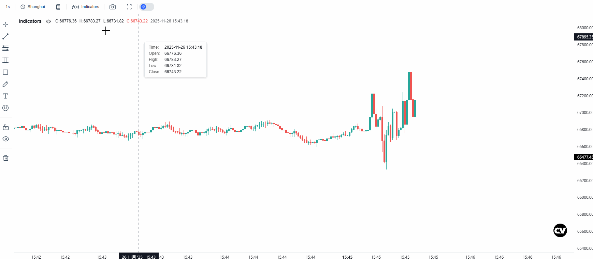

## 静态标记

### 静态标记接口参数

```typescript
interface IStaticMarkOptions {
  textColor?: string; // 文字颜色，默认白色
  backgroundColor?: string; // 背景颜色，顶部标记默认红色，底部标记默认绿色
  isCircular?: boolean; // 是否为圆形背景，默认 true
  fontSize?: number; // 字体大小，默认 9-11
  padding?: number; // 内边距，默认 3
  label?: string; // 箭头标记的标签文字
}
```

### 例子

#### 添加单个文本标记

```typescript
import { CandleView, StaticMarkDirection, StaticMarkType } from "candleview";
const chart = new CandleView({
  container: document.getElementById("chart"),
  title: "BTC/USDT",
  theme: "dark",
  data: yourKlineData,
});
chart.addTextMark(1704067200, "📈 Resistance", StaticMarkDirection.Top, {
  textColor: "#ffffff",
  backgroundColor: "#ff4444",
  isCircular: true,
  fontSize: 10,
  padding: 4,
});
chart.addTextMark(1704067300, "📉 Support", StaticMarkDirection.Bottom, {
  textColor: "#ffffff",
  backgroundColor: "#44ff44",
  isCircular: true,
  fontSize: 10,
  padding: 4,
});
```

#### 添加单箭头标记

```typescript
const chart = new CandleView({
  container: document.getElementById("chart"),
  title: "BTC/USDT",
  theme: "dark",
  data: yourKlineData,
});
chart.addArrowMark(1704067400, StaticMarkDirection.Top, {
  label: "SELL",
  backgroundColor: "#ff0000",
});
chart.addArrowMark(1704067500, StaticMarkDirection.Bottom, {
  label: "BUY",
  backgroundColor: "#00ff00",
});
```

#### 批量添加文本标记

```typescript
// Create chart instance
const chart = new CandleView({
  container: document.getElementById("chart"),
  title: "BTC/USDT",
  theme: "dark",
  data: yourKlineData,
});
chart.addTextMarks([
  {
    time: 1704067600,
    text: "📊 Open",
    direction: StaticMarkDirection.Top,
    options: { backgroundColor: "#ff8800", textColor: "#ffffff" },
  },
  {
    time: 1704067700,
    text: "💰 Add",
    direction: StaticMarkDirection.Bottom,
    options: {
      backgroundColor: "#00ff88",
      textColor: "#ffffff",
      isCircular: true,
    },
  },
  {
    time: 1704067800,
    text: "🎯 Take Profit",
    direction: StaticMarkDirection.Top,
    options: { backgroundColor: "#44aaff", textColor: "#ffffff", fontSize: 12 },
  },
]);
```

#### 批量添加箭头标记

```typescript
// Create chart instance
const chart = new CandleView({
  container: document.getElementById("chart"),
  title: "BTC/USDT",
  theme: "dark",
  data: yourKlineData,
});
chart.addArrowMarks([
  {
    time: 1704067900,
    direction: StaticMarkDirection.Top,
    options: { label: "🔻 Sell" },
  },
  {
    time: 1704068000,
    direction: StaticMarkDirection.Bottom,
    options: { label: "🔺 Buy" },
  },
  {
    time: 1704068100,
    direction: StaticMarkDirection.Top,
    options: { label: "⚠️ Caution" },
  },
]);
```

#### 混合标记（文字+箭头）

```typescript
// Create chart instance
const chart = new CandleView({
  container: document.getElementById("chart"),
  title: "BTC/USDT",
  theme: "dark",
  data: yourKlineData,
});
chart.addStaticMarks([
  {
    time: 1704068200,
    text: "📉 Strong Support",
    direction: StaticMarkDirection.Bottom,
    type: StaticMarkType.Text,
    options: { backgroundColor: "#00cc88", textColor: "#ffffff" },
  },
  {
    time: 1704068300,
    text: "",
    direction: StaticMarkDirection.Top,
    type: StaticMarkType.Arrow,
    options: { backgroundColor: "#ff5566", label: "Resistance" },
  },
  {
    time: 1704068400,
    text: "🏆 Target Hit",
    direction: StaticMarkDirection.Top,
    type: StaticMarkType.Text,
    options: {
      backgroundColor: "#ff44aa",
      textColor: "#ffffff",
      fontSize: 11,
      isCircular: false,
      padding: 6,
    },
  },
]);
```

#### 管理标记

```typescript
// Create chart instance
const chart = new CandleView({
  container: document.getElementById("chart"),
  title: "BTC/USDT",
  theme: "dark",
  data: yourKlineData,
});
// Get mark count
const count = chart.getStaticMarkCount();
console.log(`Current mark count: ${count}`);
// Clear all marks
chart.clearAllStaticMarks();
```

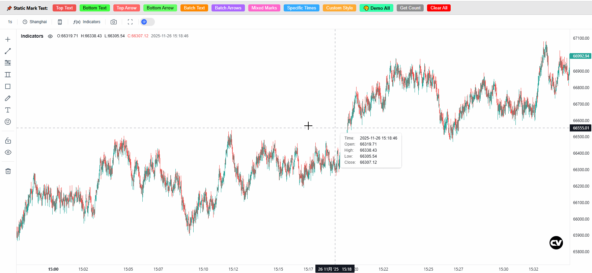

## 多面板使用表现


## 主图技术指标


## 预览

### 绘制图形

#### 斐波那契

<table>
  <tr>
    <td align="left">
    <h4>斐波那契弧形</h4>
    </td>
    <td align="left">
    <h4>斐波那契通道</h4>
    </td>
  </tr>
  <tr>
    <td align="center">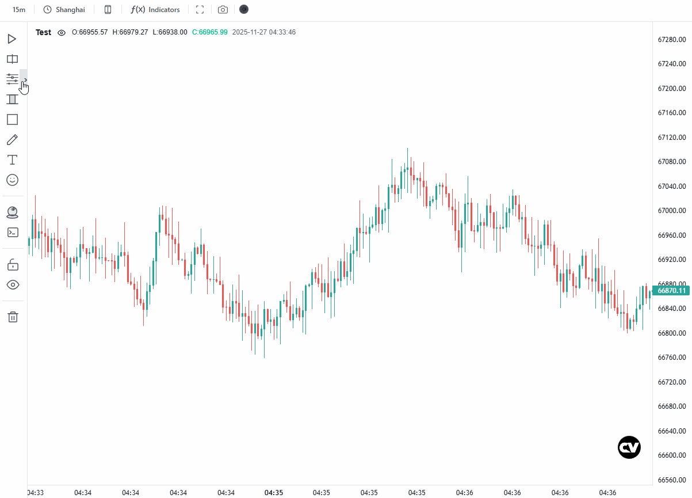</td>
    <td align="center"></td>
  </tr>
   <tr>
    <td align="left">
    <h4>斐波那契扇</h4>
    </td>
    <td align="left">
    <h4>斐波那契价格扩展线</h4>
    </td>
  </tr>
  <tr>
    <td align="center"></td>
    <td align="center">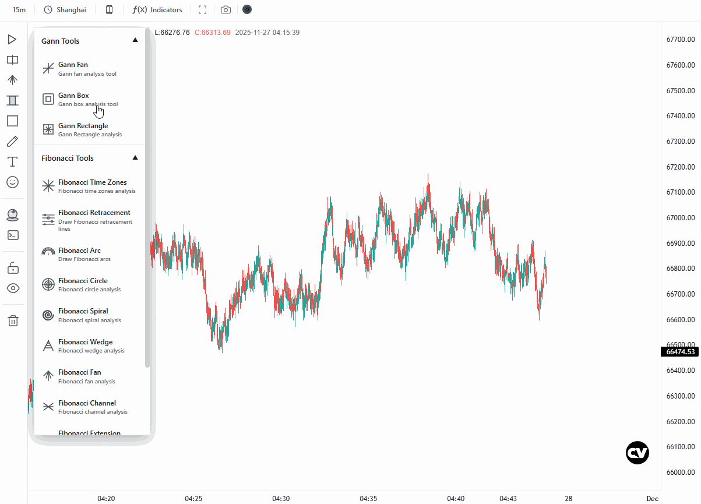</td>
  </tr>
   <tr>
    <td align="left">
    <h4>斐波那契螺旋</h4>
    </td>
    <td align="left">
    <h4>斐波那契时间扩展</h4>
    </td>
  </tr>
  <tr>
    <td align="center">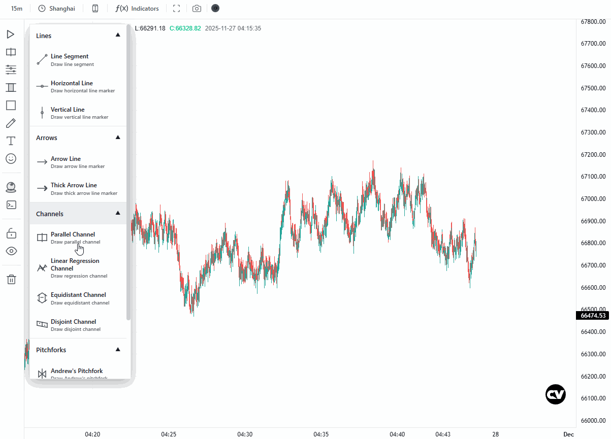</td>
    <td align="center"></td>
  </tr>
   <tr>
    <td align="left">
    <h4>斐波那契楔形</h4>
    </td>
     <td align="left">
    <h4>斐波那契时间区间</h4>
    </td>
  </tr>
  <tr>
    <td align="center">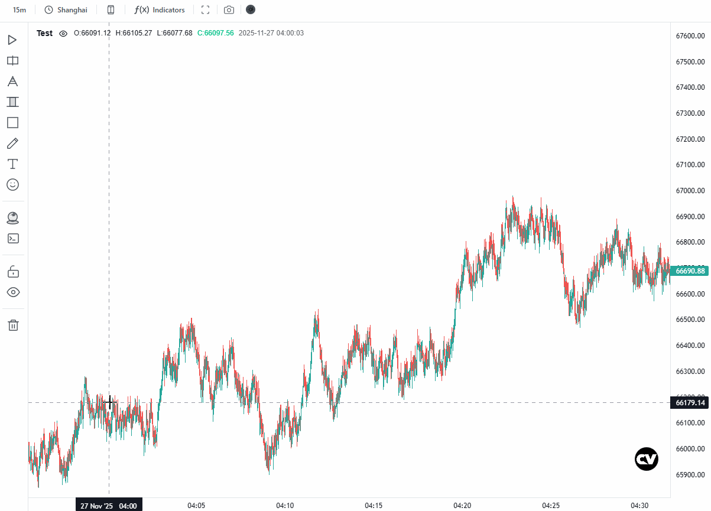</td>
      <td align="center">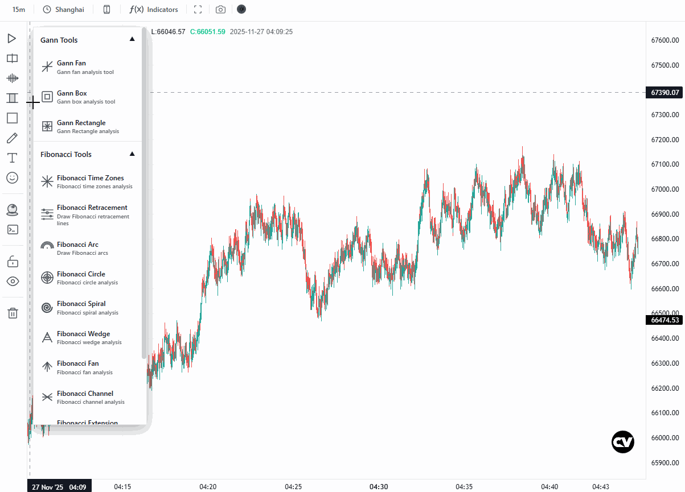</td>
  </tr>
  <tr>
     <td align="left">
    <h4>斐波那契回调</h4>
    </td>
      <td align="left">
    <h4>斐波那契圆</h4>
    </td>
  </tr>
  <tr>
      <td align="center">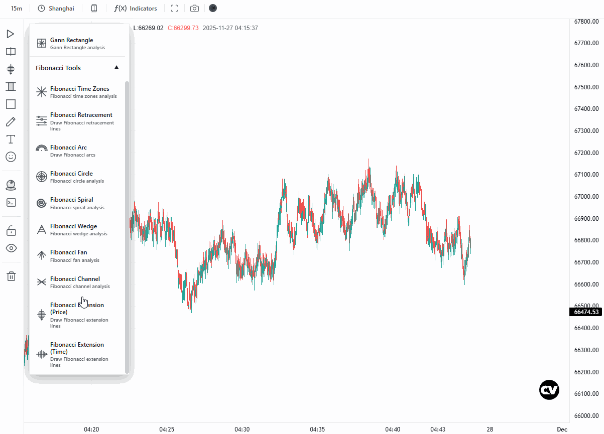</td>
         <td align="center">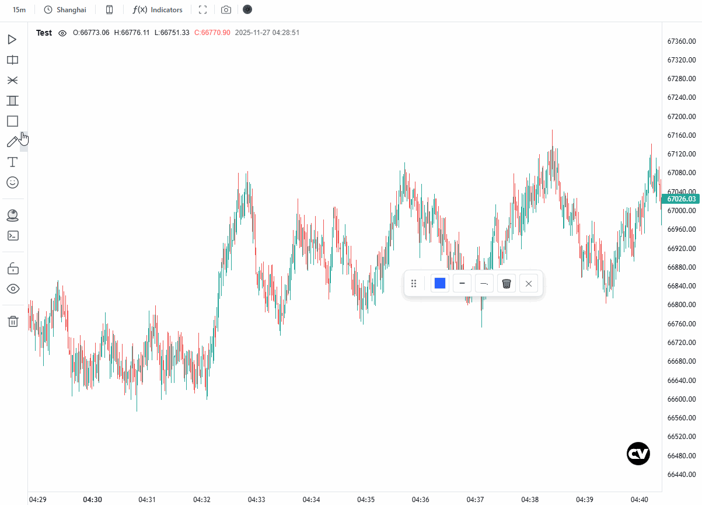</td>
  </tr>
</table>

#### 江恩系列

<table>
  <tr>
    <td align="left">
    <h4>Box</h4>
    </td>
    <td align="left">
    <h4>Fan</h4>
    </td>
  </tr>
  <tr>
    <td align="center">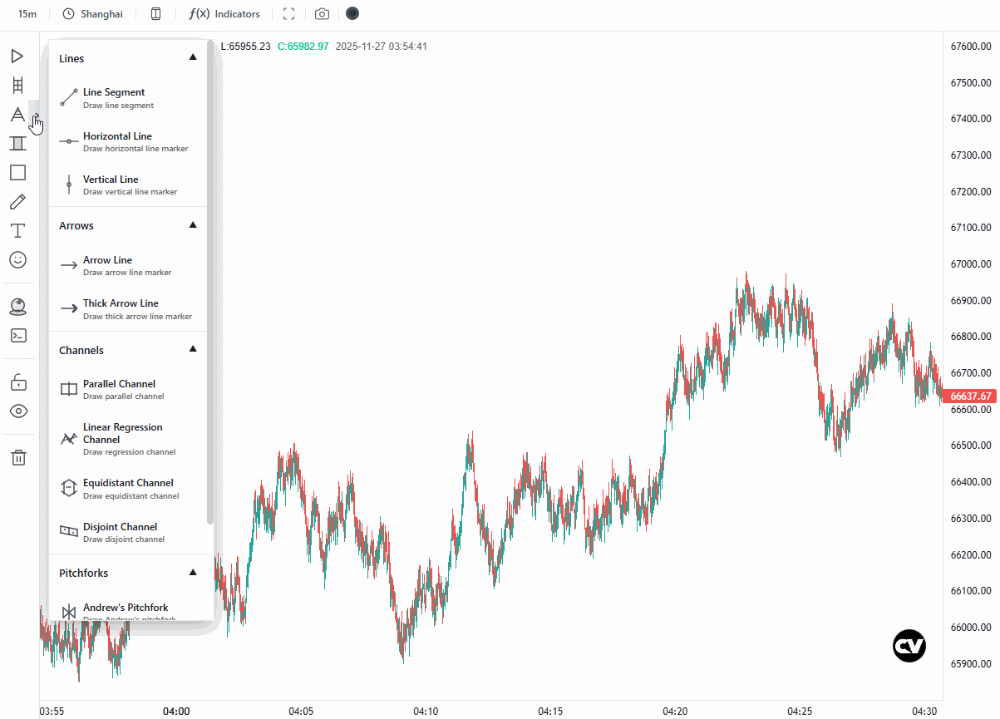</td>
    <td align="center">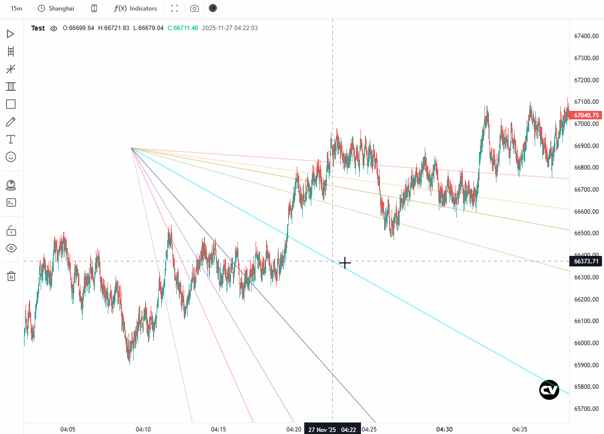</td>
  </tr>
  <tr>
    <td align="left">
    <h4>Rectangle</h4>
    </td>
  </tr>
  <tr>
    <td align="center">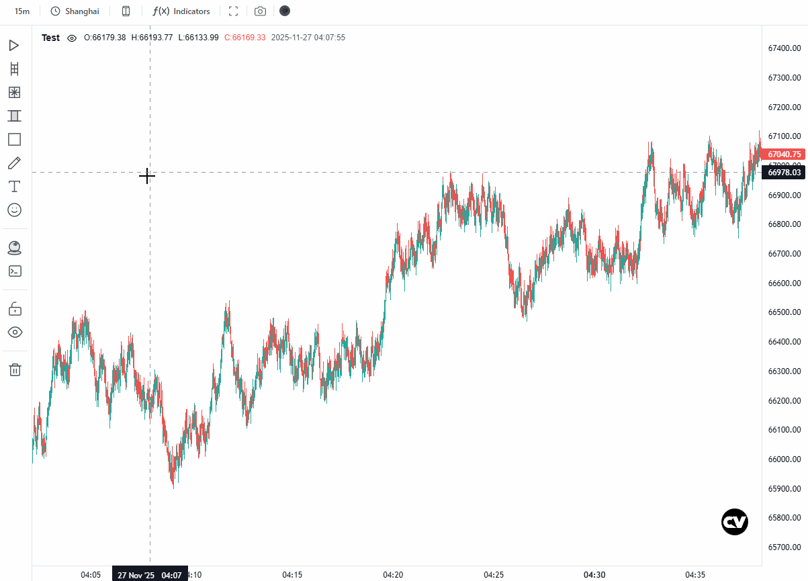</td>
  </tr>
</table>

#### 标记

<table>
  <tr>
    <td align="left">
    <h4>Mark</h4>
    </td>
  </tr>
  <tr>
    <td align="center"></td>
  </tr>
</table>

### 主题

<table>
  <tr>
    <td align="left">
    <h4>Dark</h4>
    </td>
    <td align="left">
    <h4>Light</h4>
    </td>
  </tr>
  <tr>
    <td align="center">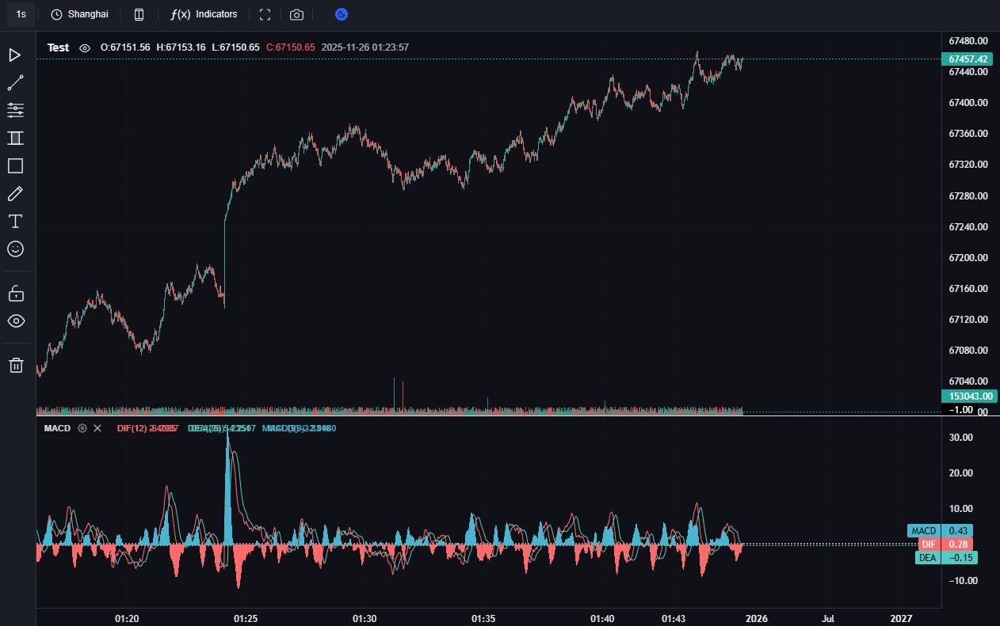</td>
    <td align="center">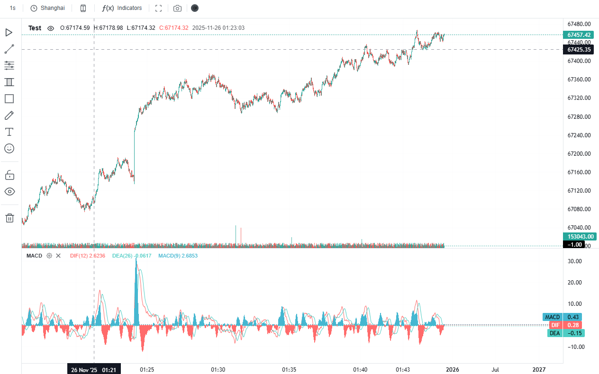</td>
  </tr>
</table>

### 国际化

<table>
  <tr>
    <td align="left">
    <h4>En</h4>
    </td>
    <td align="left">
    <h4>zh-CN</h4>
    </td>
  </tr>
  <tr>
    <td align="center">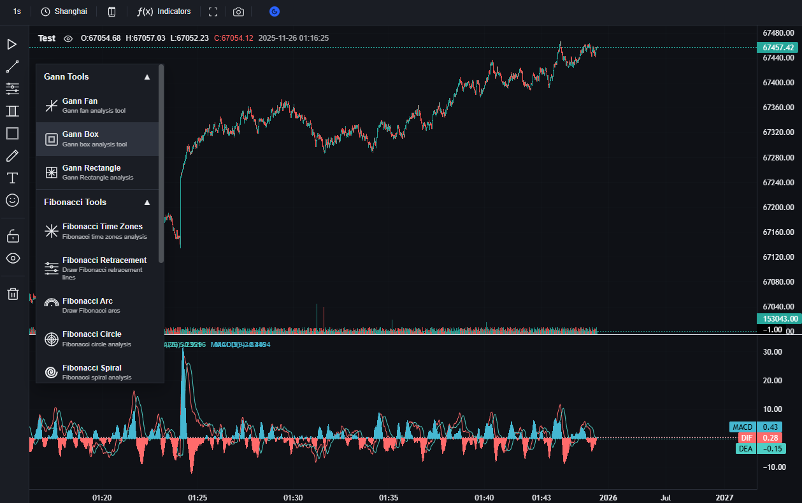</td>
    <td align="center">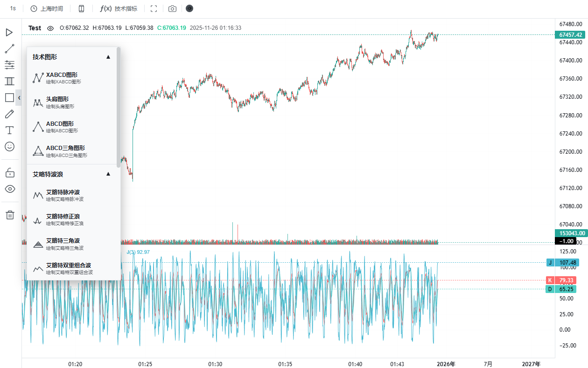</td>
  </tr>
</table>

## 🔧 配置选项

### ⏰ 支持的时间框架

#### 秒级时间框架

| 值      | 显示名称           | 描述  |
| ------- | ------------------ | ----- |
| `'1S'`  | 1 秒 / 1 Second    | 1 秒  |
| `'5S'`  | 5 秒 / 5 Seconds   | 5 秒  |
| `'15S'` | 15 秒 / 15 Seconds | 15 秒 |
| `'30S'` | 30 秒 / 30 Seconds | 30 秒 |

#### 分钟级时间框架

| 值      | 显示名称           | 描述    |
| ------- | ------------------ | ------- |
| `'1M'`  | 1 分 / 1 Minute    | 1 分钟  |
| `'3M'`  | 3 分 / 3 Minutes   | 3 分钟  |
| `'5M'`  | 5 分 / 5 Minutes   | 5 分钟  |
| `'15M'` | 15 分 / 15 Minutes | 15 分钟 |
| `'30M'` | 30 分 / 30 Minutes | 30 分钟 |
| `'45M'` | 45 分 / 45 Minutes | 45 分钟 |

#### 小时级时间框架

| 值      | 显示名称           | 描述    |
| ------- | ------------------ | ------- |
| `'1H'`  | 1 小时 / 1 Hour    | 1 小时  |
| `'2H'`  | 2 小时 / 2 Hours   | 2 小时  |
| `'3H'`  | 3 小时 / 3 Hours   | 3 小时  |
| `'4H'`  | 4 小时 / 4 Hours   | 4 小时  |
| `'6H'`  | 6 小时 / 6 Hours   | 6 小时  |
| `'8H'`  | 8 小时 / 8 Hours   | 8 小时  |
| `'12H'` | 12 小时 / 12 Hours | 12 小时 |

#### 日线级时间框架

| 值     | 显示名称      | 描述 |
| ------ | ------------- | ---- |
| `'1D'` | 1 日 / 1 Day  | 1 天 |
| `'3D'` | 3 日 / 3 Days | 3 天 |

#### 周线级时间框架

| 值     | 显示名称       | 描述 |
| ------ | -------------- | ---- |
| `'1W'` | 1 周 / 1 Week  | 1 周 |
| `'2W'` | 2 周 / 2 Weeks | 2 周 |

#### 月线级时间框架

| 值       | 显示名称        | 描述   |
| -------- | --------------- | ------ |
| `'1MON'` | 1 月 / 1 Month  | 1 个月 |
| `'3MON'` | 3 月 / 3 Months | 3 个月 |
| `'6MON'` | 6 月 / 6 Months | 6 个月 |

### 🌍 支持的时区

#### 美洲时区

| 时区 ID                 | 显示名称             | UTC 偏移    | 主要城市         |
| ----------------------- | -------------------- | ----------- | ---------------- |
| `'America/New_York'`    | 纽约 / New York      | UTC-5/UTC-4 | 纽约、华盛顿     |
| `'America/Chicago'`     | 芝加哥 / Chicago     | UTC-6/UTC-5 | 芝加哥、达拉斯   |
| `'America/Denver'`      | 丹佛 / Denver        | UTC-7/UTC-6 | 丹佛、凤凰城     |
| `'America/Los_Angeles'` | 洛杉矶 / Los Angeles | UTC-8/UTC-7 | 洛杉矶、旧金山   |
| `'America/Toronto'`     | 多伦多 / Toronto     | UTC-5/UTC-4 | 多伦多、蒙特利尔 |

#### 欧洲时区

| 时区 ID           | 显示名称             | UTC 偏移    | 主要城市             |
| ----------------- | -------------------- | ----------- | -------------------- |
| `'Europe/London'` | 伦敦 / London        | UTC+0/UTC+1 | 伦敦、都柏林         |
| `'Europe/Paris'`  | 巴黎 / Paris         | UTC+1/UTC+2 | 巴黎、柏林           |
| `'Europe/Berlin'` | 法兰克福 / Frankfurt | UTC+1/UTC+2 | 法兰克福、阿姆斯特丹 |
| `'Europe/Zurich'` | 苏黎世 / Zurich      | UTC+1/UTC+2 | 苏黎世、维也纳       |
| `'Europe/Moscow'` | 莫斯科 / Moscow      | UTC+3       | 莫斯科、伊斯坦布尔   |

#### 亚洲时区

| 时区 ID            | 显示名称           | UTC 偏移 | 主要城市       |
| ------------------ | ------------------ | -------- | -------------- |
| `'Asia/Dubai'`     | 迪拜 / Dubai       | UTC+4    | 迪拜、阿布扎比 |
| `'Asia/Karachi'`   | 卡拉奇 / Karachi   | UTC+5    | 卡拉奇、拉合尔 |
| `'Asia/Kolkata'`   | 加尔各答 / Kolkata | UTC+5:30 | 加尔各答、孟买 |
| `'Asia/Shanghai'`  | 上海 / Shanghai    | UTC+8    | 上海、北京     |
| `'Asia/Hong_Kong'` | 香港 / Hong Kong   | UTC+8    | 香港、澳门     |
| `'Asia/Singapore'` | 新加坡 / Singapore | UTC+8    | 新加坡、吉隆坡 |
| `'Asia/Tokyo'`     | 东京 / Tokyo       | UTC+9    | 东京、首尔     |
| `'Asia/Seoul'`     | 首尔 / Seoul       | UTC+9    | 首尔、平壤     |

#### 太平洋时区

| 时区 ID              | 显示名称          | UTC 偏移      | 主要城市       |
| -------------------- | ----------------- | ------------- | -------------- |
| `'Australia/Sydney'` | 悉尼 / Sydney     | UTC+10/UTC+11 | 悉尼、墨尔本   |
| `'Pacific/Auckland'` | 奥克兰 / Auckland | UTC+12/UTC+13 | 奥克兰、惠灵顿 |

#### 全球时区

| 时区 ID | 显示名称  | UTC 偏移 | 描述       |
| ------- | --------- | -------- | ---------- |
| `'UTC'` | UTC / UTC | UTC+0    | 协调世界时 |

## 🌟 核心特性

### 📈 支持的技术指标

#### 主图指标

- 移动平均线 (MA)
- 指数移动平均线 (EMA)
- 布林带 (Bollinger Bands)
- 一目均衡表 (Ichimoku Cloud)
- 唐奇安通道 (Donchian Channel)
- 包络线 (Envelope)
- 成交量加权平均价 (VWAP)
- 热力图 (Heat Map)
- 市场轮廓图 (Market Profile)

#### 副图指标

- 相对强弱指数 (RSI)
- 指数平滑异同平均线 (MACD)
- 成交量 (Volume)
- 抛物线转向指标 (SAR)
- 随机指标 (KDJ)
- 平均真实波幅 (ATR)
- 随机振荡器 (Stochastic Oscillator)
- 商品通道指数 (CCI)
- 布林带宽度 (Bollinger Bands Width)
- 平均趋向指数 (ADX)
- 能量潮指标 (OBV)

### 🎨 支持的绘图工具

#### 基础工具

- 铅笔、钢笔、画笔、记号笔、橡皮擦
- 线段、水平线、垂直线
- 箭头线、粗箭头线

#### 通道工具

- 平行通道
- 线性回归通道
- 等距通道
- 非连续通道

#### 斐波那契工具

- 斐波那契回撤
- 斐波那契时间分区
- 斐波那契弧线
- 斐波那契圆形
- 斐波那契螺旋
- 斐波那契扇形
- 斐波那契通道
- 斐波那契价格扩展
- 斐波那契时间扩展

#### 甘氏工具

- 甘氏扇形
- 甘氏箱
- 甘氏矩形

#### 形态工具

- 安德鲁音叉
- 增强安德鲁音叉
- 希夫音叉
- XABCD 模式
- 头肩形态
- ABCD 模式
- 三角 ABCD 模式

#### 艾略特波浪

- 艾略特推动浪
- 艾略特调整浪
- 艾略特三角形
- 艾略特双重组合
- 艾略特三重组合

#### 几何图形

- 矩形、圆形、椭圆、三角形
- 扇形、曲线、双曲线

#### 标注工具

- 文本标注、价格标注
- 气泡框、图钉、路标
- 价格标签、旗标
- 图片插入

#### 范围工具

- 时间范围、价格范围
- 时间价格范围
- 热力图

#### 交易工具

- 多头位置、空头位置
- 模拟 K 线

### ⏰ 支持的时间框架

#### 秒级

- 1 秒、5 秒、15 秒、30 秒

#### 分钟级

- 1 分钟、3 分钟、5 分钟、15 分钟
- 30 分钟、45 分钟

#### 小时级

- 1 小时、2 小时、3 小时、4 小时
- 6 小时、8 小时、12 小时

#### 日线级

- 1 天、3 天

#### 周线级

- 1 周、2 周

#### 月线级

- 1 月、3 月、6 月

### 🌍 支持的时区

- 纽约 (America/New_York)
- 芝加哥 (America/Chicago)
- 丹佛 (America/Denver)
- 洛杉矶 (America/Los_Angeles)
- 多伦多 (America/Toronto)
- 伦敦 (Europe/London)
- 巴黎 (Europe/Paris)
- 法兰克福 (Europe/Berlin)
- 苏黎世 (Europe/Zurich)
- 莫斯科 (Europe/Moscow)
- 迪拜 (Asia/Dubai)
- 卡拉奇 (Asia/Karachi)
- 加尔各答 (Asia/Kolkata)
- 上海 (Asia/Shanghai)
- 香港 (Asia/Hong_Kong)
- 新加坡 (Asia/Singapore)
- 东京 (Asia/Tokyo)
- 首尔 (Asia/Seoul)
- 悉尼 (Australia/Sydney)
- 奥克兰 (Pacific/Auckland)
- UTC

### 🎯 支持的图表类型

- K 线图 (Candlestick Chart)
- 空心 K 线图 (Hollow Candlestick Chart)
- 美国线图 (Bar Chart / OHLC)
- 基线图 (BaseLine Chart)
- 折线图 (Line Chart)
- 面积图 (Area Chart)
- 阶梯图 (Step Line Chart)
- 平均 K 线图 (Heikin Ashi Chart)
- 直方图 (Histogram Chart)
- 新价线图 (Line Break Chart)
- 山形图 (Mountain Chart)
- 基线面积图 (Baseline Area Chart)
- 高低图 (High Low Chart)
- 高低收盘面积图 (HLCArea Chart)
